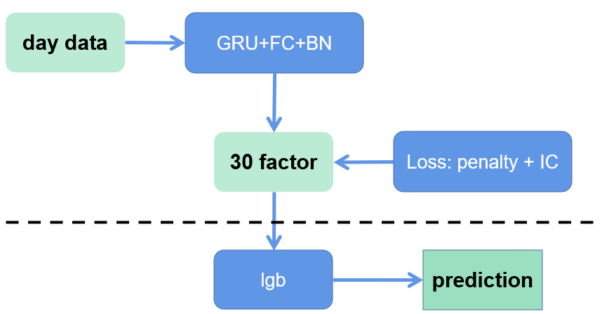

# 周频量价指增模型

## 1. 运行程序

将复权后的数据以feather形式放在`./data/adj_table/`下作为整个程序的初始数据。之后使用如下指令让程序预处理日频的表格，并且根据可能出现的数据缺失删除（`000043.SZ`股票存在复权因子缺失的问题）。生成的日频数据保存在`./data/day_table`目录下。

```bash
python table_pro.py --day --fix
```

之后根据生成的日频数据生成对应的每个交易日所有股票的数据点。结果会自动保存在`./data/day_datapoint/`下。

```bash
python gen_daypoint.py
```

之后使用`main_multi.py`训练得到GRU模型生成的30个因子。指定第一个参数为训练数据的截止时间，在下面的例子中训练数据从2016-01-01到2016-12-31。指定的第二个参数为训练使用的label，指定0表示使用T+0到T+5的收益率作为label。训练好的模型会保存在`./data/result0/`下。

```bash
python main_multi.py --end 2016-12-31 --target 0
```

使用之前训练出来的模型给原始数据生成对应的因子，每个原始数据点都可以生成30个因子。

第一个参数为训练数据的起始时间点；

第二个参数为训练数据的结束之间点；

第三个参数指定测试集的结束时间。

在下面的例子中使用了之前训练得到的模型生成了本身训练集对应的因子，并且在2017-01-01到2017-12-31这一段测试集上同样生成了对应的因子。程序将生成的因子值以txt文件的格式储存在`./data/result0/`目录下。

```bash
python gen_embedding.py --start 2016-01-01 --endtrain 2016-12-31 --endtest 2017-12-31 --target 0
```

之后根据生成的多因子训练LightGB，同时根据每个月滚动训练一次的方式对下个的测试数据进行预测。

参数一指定训练集开始日期；

参数二指定第一次滚动训练训练集截止日期；

第三个参数指定测试集截止日期；

第四个参数指定使用的label；

程序会将预测结果以CSV文件的格式储存在`./data/result0/`目录下。并且训练过程中每一次滚动训练生成的lgb模型也会以txt格式的文件储存在该目录下。

```bash
python lgb_train.py --start 2016-01-01 --endtrain 2016-12-31 --endtest 2017-12-31 --target 0
```

在本仓库下提供了额外的代码将所有的预测结果合并，如下：

```bash
python concat_result.py
```

接下来会详细解释数据处理、模型和训练等模块的代码。

## 2. 数据处理

数据处理大致分为两个部分：

1. 生成日频表格

2. 根据日频表格生成每个交易日的数据点

生成日频数据表格和之前的代码完全一样，只是文件格式由csv变成了feather来节约存储空间。根据日频表格生成数据点的过程和之前代码结构相同。区别主要体现在一下两点：

1. 时间长度不同，该数据集日频的数据长度为30个交易日；

2. 标准化处理不同，该数据仅使用时序标准化，将价格信息除以最后一天的close，将volume除以最后一天的volume来进行时序标准化；

3. 生成label数量增多，一次储存了T+0到T+5、T+0到T+10、T+0到T+20、T+1到T+6、T+1到T+11、T+1到T+21总共6个label。

生成数据点部分的主要代码如下。在下面代码中可以看到大段生成label的代码。由于生成label的长度较长，因此为了统一处理选择的股票必须满足能供生成全部label，即选择的股票在T-29到T+21这50个交易日中必须一直在市场上交易，出现退市停牌等情况的股票会被删除。

```python
def process_daypoint(args):
    # print("Process ID:", current_process().pid)
    date_list, table_list, i = args
    stock_set = set(table_list[i]["code"])
    basic_info = []
    target = []
    open = []
    high = []
    low = []
    close = []
    vwap = []
    volume = []

    # get the included stock code & group table by code
    j = i - 29
    group_table = []
    while j <= i: # 0-29
        stock_set = stock_set & set(table_list[j]["code"])
        group_table.append(table_list[j].groupby('code'))
        j += 1
    while j <= i + 21: #29-50
        stock_set = stock_set & set(table_list[j]["code"])
        j += 1

    # generate daypoint for each stock
    for stock in tqdm(stock_set):
        # get basic info [stock, date]
        basic_info.append([stock, date_list[i].strftime('%Y-%m-%d')])

        # get target
        T0_close = table_list[i][table_list[i]["code"] == stock]["close"].item()[-1]
        T1_close = table_list[i + 1][table_list[i + 1]["code"] == stock]["close"].item()[-1]
        T5_close = table_list[i + 5][table_list[i + 5]["code"] == stock]["close"].item()[-1]
        T6_close = table_list[i + 6][table_list[i + 6]["code"] == stock]["close"].item()[-1]
        T10_close = table_list[i + 10][table_list[i + 10]["code"] == stock]["close"].item()[-1]
        T11_close = table_list[i + 11][table_list[i + 11]["code"] == stock]["close"].item()[-1]
        T20_close = table_list[i + 20][table_list[i + 20]["code"] == stock]["close"].item()[-1]
        T21_close = table_list[i + 21][table_list[i + 21]["code"] == stock]["close"].item()[-1]

        target0 = (T5_close - T0_close) / T0_close
        target1 = (T10_close - T0_close) / T0_close
        target2 = (T20_close - T0_close) / T0_close
        target3 = (T6_close - T1_close) / T1_close
        target4 = (T11_close - T1_close) / T1_close
        target5 = (T21_close - T1_close) / T1_close

        target.append([target0, target1, target2, target3, target4, target5])

        # get feature
        result = [[], [], [], [], [], []]
        for iter_table in group_table:
            stock_table = iter_table.get_group(stock).reset_index(drop=True)
            result[0].extend(list(stock_table["open"].tolist()[0]))
            result[1].extend(list(stock_table["high"].tolist()[0]))
            result[2].extend(list(stock_table["low"].tolist()[0]))
            result[3].extend(list(stock_table["close"].tolist()[0]))
            result[4].extend(list(stock_table["vwap"].tolist()[0]))
            tmp_v = list(stock_table["volume"].tolist()[0]) # set volume to 1 if it is 0
            result[5].extend([1 if x == 0 else x for x in tmp_v]) 

        open.append(result[0])
        high.append(result[1])
        low.append(result[2])
        close.append(result[3])
        vwap.append(result[4])
        volume.append(result[5])

    # normalize feature
    volume = np.array(volume)
    open = np.array(open)
    high = np.array(high)
    low = np.array(low) 
    close = np.array(close)
    vwap = np.array(vwap)
    basic_info = np.array(basic_info)

    volume = volume / volume[:, -1].reshape((-1, 1))
    open = open / close[:, -1].reshape((-1, 1))
    high = high / close[:, -1].reshape((-1, 1))
    low = low / close[:, -1].reshape((-1, 1))
    vwap = vwap / close[:, -1].reshape((-1, 1))
    close = close / close[:, -1].reshape((-1, 1))

    day_data = np.concatenate([basic_info, target, open, high, low, close, vwap, volume], axis=1)
    np.savetxt(f"./data/day_datapoint/{date_list[i].strftime('%Y-%m-%d')}.txt", day_data, fmt="%s")
    print(date_list[i].strftime('%Y-%m-%d'))
```

## 3. 因子生成

因子生成的过程主要分为两步：

1. 训练生成因子的模型，例如GRU；

2. 使用模型在训练集和测试集上生成因子；

在训练因子生成的模型过程中主要使用的模型结构如下：



模型部分为常见的GRU+FC+BN，损失函数由两部分组成，即IC和penalty，具体的计算过程如下：

$$
c_i = \frac{1}{K} \sum_k z_{i, k}\\
loss_{IC} = -corr(c_i, y_i)\\
loss_{penalty} = \sum_{k \neq k'} corr(z_{i, k}, z_{i, k'})^2\\
loss = loss_{IC} + loss_{penalty}
$$

该损失函数的代码实现如下，在实际的代码实现过程中给penalty设置了权重，否则penalty的绝对值过大，影响实际学习过程中因子和收益率的相关性。

```python
# correctness checked
# @para pred: torch.tensor of shape (x)
# @para true: torch.tensor of shape (x)
# retur -corr between pred and truedef cal_negcorr(pred, true):
    y = torch.cat((pred.view(1, -1), true.view(1, -1)), dim=0)
    corr = torch.corrcoef(y)[0, 1]
    return -corr

def loss_fn(pred, true, L2_weight):
    pred_mean = torch.mean(pred, dim=1)
    neg_ic = cal_negcorr(pred_mean, true)
    corr_mat = torch.corrcoef(pred.T)
    L2norm = torch.norm(corr_mat) # L2norm of corr mat, ie penalty

    return neg_ic + L2_weight * L2norm, neg_ic, L2norm
```

在训练过程中模型根据一年的频率滚动训练。举例来说第一次训练的过程使用2016-01-01到2016-12-31的数据根据训练集：验证集为4：1的比例进行训练。训练完成的GRU会给2016-01-01到2016-12-31这些已知的数据集生成因子，之后会在需要预测的数据集上生成因子，即2017-01-01到2017-12-31。这里为了防止数据泄露，2016年最后几天的数据在训练过程中被删除。

## 4. 训练LightGB

在GRU模型生成的因子基础上使用lgb模型进行训练，并且预测得到最终的结果，作为交易信号进行回测。

由于lgb和GRU的滚动训练频率不同，因此不能在训练GRU的同时训练lgb进而给出预测结果。lgb的滚动训练频率为一个月，因此一次GRU模型生成的因子可以给12次lgb滚动训练使用。继续上面的举例，当GRU模型给训练集和测试生成了因子值之后，第一次给lgb滚动训练的过程是使用2016-01-01到2016-12-31的因子值作为训练集和验证集，预测得到2017-01-01到2017-01-31的结果。第二次滚动训练lgb使用2016-01-01到2017-01-31的因子值作为训练集和验证集，预测得到2017-02-01到2017-02-28的结果，以此类推。

可能存在疑问的点是第二次滚动训练过程中2017-01-01到2017-01-31的因子值是由之前的GRU模型预测生成的。这种处理方式同样是为了保证不存在数据泄露。

每次滚动训练的代码如下所示。在每次滚动训练的过程中根据训练集：验证集=4：1的规则将数据集划分，并且保存了lgb的模型参数和预测下一个月的结果。在训练lgb的过程中同样舍去了数据集最后的五个数据，来防止训练过程中的数据泄露。

```python
def pred_month(start, endtrain, endtest, target):
    # Step 1: Load and Prepare the Data
    data = np.loadtxt(f'./data/result0/{start}_{endtest}.txt', delimiter=' ', dtype=str)
    print(data.shape)

    info = data[:, :2]
    y = data[:, 2:8].astype(float)
    X = data[:, 8:].astype(float)

    print(y.shape)
    print(X.shape)

    train_index = 0
    for row in data:
        if row[1] > endtrain:
            break
        train_index += 1
    print(train_index)
    split_index = int(train_index * 0.8)
    # exit()
    X_train, X_val, X_test = X[:split_index, :], X[split_index: train_index, :], X[train_index:, :]
    y_train, y_val, y_test = y[:split_index, :], y[split_index: train_index, :], y[train_index:, :]
    info_test = info[train_index:, :]

    # Step 2: Create a LightGBM Dataset
    train_data = lgb.Dataset(X_train, label=y_train[:, target])
    val_data = lgb.Dataset(X_val, label=y_val[:, target])

    # Step 3: Set Up Parameters
    params = {
        'boosting_type': 'gbdt',
        'objective': 'binary',
        'metric': 'binary_logloss',
        'num_leaves': 31,
        'learning_rate': 0.05,
        'feature_fraction': 0.9,
        'bagging_fraction': 0.8,
        'bagging_freq': 5,
        'verbose': 0
    }

    # Step 4: Train the Model
    num_boost_round = 100
    model = lgb.train(params, train_data, num_boost_round=num_boost_round, valid_sets=[val_data])

    # Step 5: Save the Model
    model.save_model(f"./data/result0/lgb_{start}_{endtest}.txt")

    # Step 6: Load the Model
    model = lgb.Booster(model_file=f"./data/result0/{start}_{endtest}_lgb.txt")

    # Step 7: Make Predictions on New Data
    # Assuming you have new data stored in a DataFrame called 'new_data'
    y_pred = model.predict(X_val)
    print(y_pred.shape)
    print(y_val[:, 0].shape)
    print(loss_fn(torch.tensor(y_pred), torch.tensor(y_val[:, target])))

    y_test_pred = model.predict(X_test)
    test_loss = loss_fn(torch.tensor(y_test_pred), torch.tensor(y_test[:, target]))
    print(test_loss)

    result = np.concatenate([info_test, y_test_pred.reshape((-1, 1))], axis=1)
    np.savetxt(f"./data/result0/{endtrain}_{endtest}_pred.csv", result, fmt="%s")


```

## 5. 结果分析

将生成的结果通过sqfactor进行回测，得到的回测结果如下：


